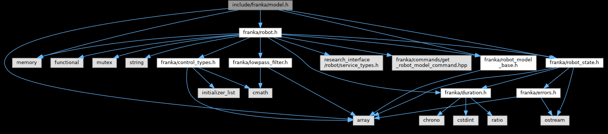

# 机器人坐标系

## 1. 官方示例程序

物理连接好机器人，并激活`FCI`后，可通过官方示例程序`print_joint_poses`得到机器人当前各关节位姿。

```console
$ print_joint_poses 172.16.0.2
[0.996195,0.0871569,0,0,-0.0871569,0.996195,0,0,0,0,1,0,0,0,0.333,1]
[0.732421,0.0640794,0.67783,0,0.675251,0.0590776,-0.735219,0,-0.0871569,0.996195,0,0,0,0,0.333,1]
[0.729513,0.0936028,0.677532,0,-0.108845,0.993855,-0.0201075,0,-0.675251,-0.0590776,0.735219,0,-0.213514,-0.0186803,0.565476,1]
[0.102232,-0.00892871,-0.994721,0,0.988788,0.110326,0.100632,0,0.108845,-0.993855,0.0201075,0,-0.153329,-0.0109581,0.621373,1]
[0.101835,-0.005316,-0.994787,0,-0.109216,0.993881,-0.0164915,0,0.988788,0.110326,0.100632,0,0.218129,0.0321659,0.7421,1]
[0.993671,0.109601,0.0245929,0,-0.0262499,0.0137012,0.999562,0,0.109216,-0.993881,0.0164915,0,0.218129,0.0321659,0.7421,1]
[0.719616,-0.69379,0.0284081,0,-0.693875,-0.720047,-0.00835229,0,0.0262499,-0.0137012,-0.999562,0,0.305572,0.0418108,0.744264,1]
[0.719616,-0.69379,0.0284081,0,-0.693875,-0.720047,-0.00835229,0,0.0262499,-0.0137012,-0.999562,0,0.308381,0.0403448,0.637311,1]
[0.99949,0.0185659,0.0259935,0,0.0182016,-0.999734,0.0141816,0,0.0262499,-0.0137012,-0.999562,0,0.311095,0.0389281,0.533956,1]
```

源代码中输出齐次变换矩阵的部分如下：

```c++
franka::Robot robot(argv[1]);
franka::RobotState state = robot.readOnce();
franka::Model model(robot.loadModel());
for (franka::Frame frame = franka::Frame::kJoint1;
     frame <= franka::Frame::kEndEffector;
     frame++){
    std::cout << model.pose(frame, state) << std::endl;
}
```

这里导入的头文件是

```c++
#include <franka/model.h>
```

与其他模块的依赖关系如下：



## 2. 主要修改

使用`yaml-cpp`库，将机器人IP地址放在配置文件中，从而使项目更规范。并实现了在不同路径下读取配置文件的功能，源代码在[源文件ReadConfig.cpp](../src/ReadConfig.cpp)中，可引用[头文件ReadConfig.h](../include/ReadConfig.h)调用。

此外，实现了将`std::array<double, 16>`类型的齐次变换矩阵的元素，转化为`Eigen::Matrix4d`类型的$4 \times 4$矩阵。相关功能源代码在[源文件ToEigen.cpp](../src/ToEigen.cpp)中，可引用[头文件ToEigen.h](../include/ToEigen.h)调用。
